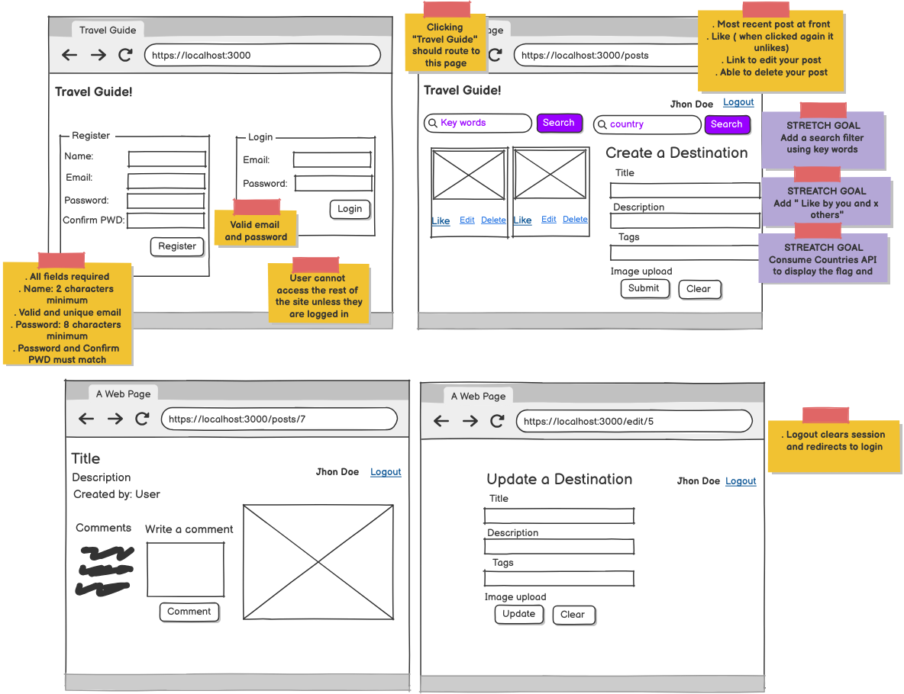

# Travel Guide Project
This repository contains the structure and design of the Travel Guide application, which allows users to create, browse, edit, and delete travel posts.

## Project Overview
### Login/Register Page
- User Registration Requirements:
- Name: At least 2 characters.
- Email: Valid and unique.
- Password: At least 8 characters, with confirmation to match.
- Login: Requires a valid email and password.
Users cannot access the rest of the site unless logged in.

### Posts Page
Displays posts, with the most recent post at the front.
Users can search posts using:
Keywords.
Country.
For each post, users can:
- Like or Unlike the post.
- Edit or delete their own posts.

### Create a Destination Page
- Form fields:
Title, Description, Tags, Image upload.
- Buttons: Submit and Clear.
- Stretch Goals:
Add a search filter using keywords.
Show like count on posts.
Use the Countries API to display flags.

### Post Details Page
- Shows:
Title, Description, and the post creator's name.
- Users can:
Write comments.
Logout (which clears the session and redirects to login).

### Update Destination Page
Form fields for editing a post:
Title, Description, Tags, Image upload.
Buttons: Update and Clear.

### Logout
Logs out the user, clearing the session and redirecting to the login page.

### Stretch Goals
- Implement search filters by keywords.
- Display the number of likes on posts.
- Integrate with a Countries API to display flags.
